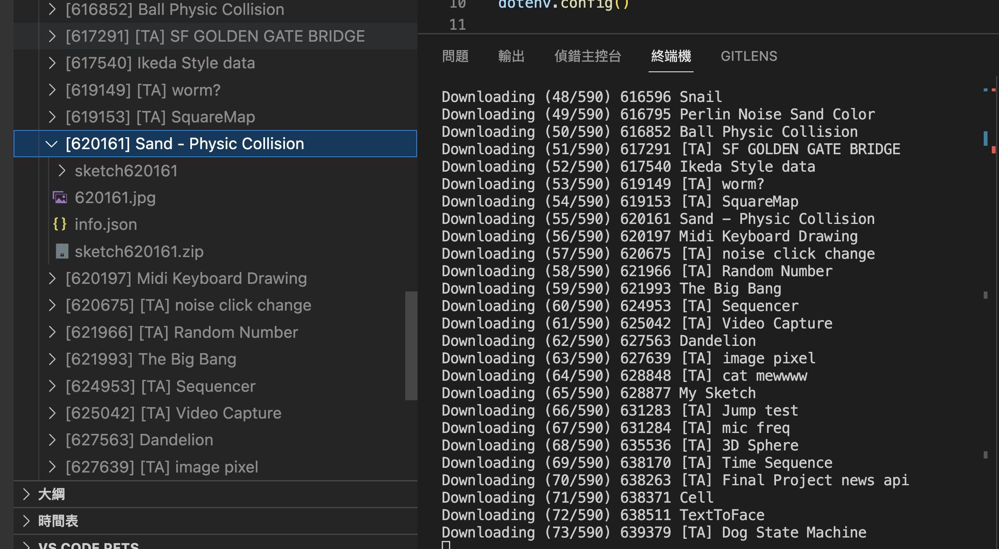

# openprocessing-backup
To backup all your sketches

```
cp .env.example .env
npm install
npm start
```

The program will automatically download all the sketches with assigned userid in the following structure.
- sketches
  -  `id` `title`
     -  info.json
     -  `id`.jpg
     -  sketch`id`.zip
     -  unziped sketch source code folder



## Work Data format
```
{
  "visualID": "587576",
  "title": "My Sketch",
  "isPjs": "2",
  "description": "",
  "instructions": "",
  "tags": [],
  "license": "by-nc-sa",
  "imports": "",
  "active": "1",
  "isDraft": "0",
  "isPrivate": "0",
  "hideSourceCode": "0",
  "cdn": "",
  "isOnS3": "2018-09-10 15:59:19",
  "createdOn": "2018-09-10 15:59:19",
  "updatedOn": null,
  "pinnedOn": null,
  "filesUpdatedOn": null,
  "thumbnailUpdatedOn": "2018-09-10 15:59:19",
  "parentID": "0",
  "engineID": "40",
  "codeObjects": [],
  "isArticle": "0",
  "isTutorial": "0",
  "isTemplate": "0",
  "hasFrameBorder": "1",
  "loopProtect": "0",
  "commentMode": "1",
  "ipfsHash": null,
  "libraries": [],
  "templateID": null,
  "userID": "139364",
  "isArchived": -1
}
```